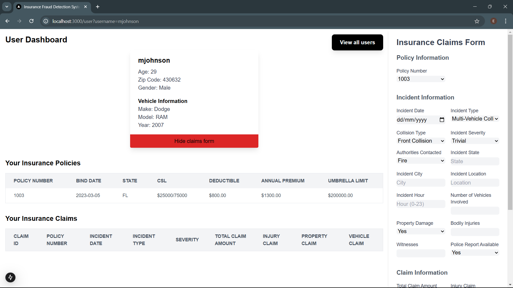

# Insurance Application README

## Overview
This project is a web-based insurance application that allows administrators to manage claims and detect fraudulent activity. The system offers distinct interfaces for administrators and users, providing a streamlined experience for claims submission and monitoring, while supporting a data-driven fraud detection model.

## Features
- **Claim Management**: Admins can view and monitor all insurance claims.
- **Fraud Detection**: Admins have tools to assess and confirm fraudulent claims.
- **Blacklisting**: Users with suspicious behavior can be blacklisted, limiting their access.
- **User Dashboard**: Users have a dashboard to view and manage their own claims.
- **Data Analytics**: Embedded Tableau dashboard gives admins insights into claims data and fraud trends.

## Screenshots
Here’s a visual guide to the core pages of the application:

### 1. Landing Page

*The starting page of the application.*

---

### 2. Admin Dashboard

*Admins can view all claims, including those flagged as potentially fraudulent.*

---

### 3. User Dashboard

*Users can view their claims and access relevant information.*

---

### 4. Claims Form (User)
- **Claims Form A**  
  
- **Claims Form B**  
  

*Forms that users fill out to submit claims.*

---

### 5. Blacklist

*Page displaying users who have been blacklisted from submitting new claims.*

---

### 6. Data Overview

*Embedded Tableau dashboard providing analytics and data used for the predictive fraud model.*

---

### 7. Fraud Monitoring

*Admin view of the fraud monitoring dashboard where suspicious claims can be confirmed or dismissed.*

---

### 8. Suspicious User Overlay

*Screen that restricts a blacklisted user from accessing application features.*

---

### 9. User Selection

*Page that allows users to select their profile to access their dashboard, as there is no login required.*

---

## Installation
1. Clone the repository.
   ```bash
   git clone <repository-url>
    pnpm install
    pnpm dev